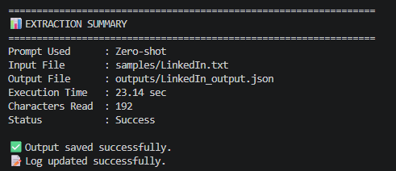
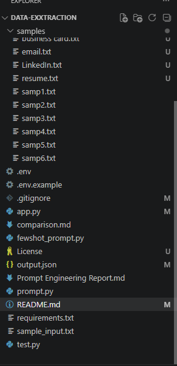
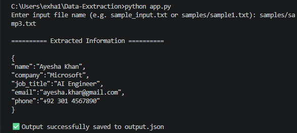

# 🤖 LLM Information Extraction using Prompt Engineering


## 📖 Overview

This project extracts structured information from unstructured text using Google's Gemini Large Language Model (LLM).

The application demonstrates Prompt Engineering concepts by implementing both **Zero-shot Prompting** and **Few-shot Prompting** to convert free-form text into structured JSON output.

Users can select the prompting technique, provide an input text file, and receive extracted information in a standardized JSON format.

---


## 🎯 Motivation

Large Language Models can understand unstructured information, but extracting reliable structured data requires careful prompt design.

This project explores how different prompting strategies affect extraction quality.


# ✨ Features

- ✅ Zero-shot Prompting
- ✅ Few-shot Prompting
- ✅ Interactive CLI
- ✅ Google Gemini API Integration
- ✅ Structured JSON Output
- ✅ Temperature = 0 for deterministic responses
- ✅ Automatic Output File Generation
- ✅ Execution Logging
- ✅ Professional Folder Structure

---

# Demo 
# 🎥 Demo

The application demonstrates how Large Language Models can transform unstructured text into structured information using different prompting strategies.

CLI workflow:

1. Select prompting technique
2. Provide input text file
3. Gemini extracts structured information
4. JSON output is generated


# 📂 Project Structure

```text
LLM-Information-Extraction/
│
├── app.py
├── prompt.py
├── fewshot_prompt.py
├── sample_input.txt
├── README.md
├── requirements.txt
├── .gitignore
├── .env.example
│
├── samples/
│   ├── sample1.txt
│   ├── sample2.txt
│   ├── sample3.txt
│   ├── sample4.txt
│   └── sample5.txt
│
├── outputs/
│
├── logs/
│
└── docs/
```

---

# 🛠️ Technologies Used

- Python
- Google Gemini API
- Prompt Engineering
- JSON
- python-dotenv

---

# 🚀 Installation

Clone the repository

```bash
git clone https://github.com/Eisha017/LLM-Information-Extraction.git
```

Move into the project

```bash
cd LLM-Information-Extraction
```

Install dependencies

```bash
pip install -r requirements.txt
```

---

# 🔑 Configure API Key

Create a `.env` file.

```text
GEMINI_API_KEY=YOUR_API_KEY
```

---

# ▶️ Running the Project

Run

```bash
python app.py
```

The application will ask you to:

1. Select Prompt Technique
2. Enter Input File
3. Extract Information

---

# 📥 Example Input

```text
Hello,

My name is Sarah Johnson.

I work as a Software Engineer at Google.

Email:
sarah@gmail.com

Phone:
+1 555 111 2233
```

---

# 📤 Example Output

```json
{
    "name":"Sarah Johnson",
    "company":"Google",
    "job_title":"Software Engineer",
    "email":"sarah@gmail.com",
    "phone":"+1 555 111 2233"
}
```

---

# 🧠 Prompt Engineering Concepts Used

## Zero-shot Prompting

The model extracts information without seeing any examples.

Used for general-purpose information extraction.

---

## Few-shot Prompting

The model receives example inputs and outputs before processing the user's text.

This improves consistency and extraction accuracy.

---

## Delimiters

Triple hash delimiters (`###`) separate instructions from user input, making the prompt clearer and reducing ambiguity.

---

## Temperature = 0

A temperature value of **0** ensures deterministic responses.

Running the same prompt multiple times is more likely to produce consistent outputs.

---

# 📊 Output

The application automatically generates:

- JSON output files
- Execution logs
- Processing summary

---

# 📸 Screenshots

### Terminal Output


### Project Structure


### Sample JSON Output


---

# 🔮 Future Improvements

- Streamlit Web Interface
- Batch Processing
- PDF Support
- Resume Parsing
- CSV Export
- OCR Integration
- Docker Deployment
- REST API


---

# 👩‍💻 Author

**Eisha Naeem**

Computer Engineering Student

GitHub:
https://github.com/Eisha017

LinkedIn:
https://www.linkedin.com/in/eishaa-naeem

---

# ⭐ If you found this project useful, consider giving it a star.